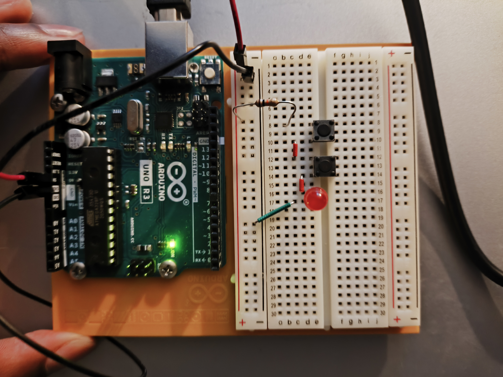
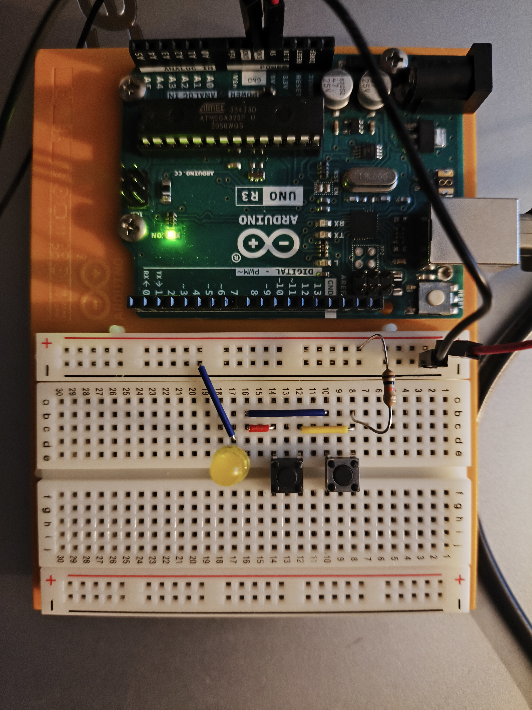

# 🔌 Arduino Starter Kit - Project 1 : Know Your Tools

## 🧭 Table of Contents
- [Overview](#-overview)
- [Components Used](#-Components-used)
- [Series Circuit](#-series-circuit)
- [Parallel Circuit](#-parallel-circuit)
- [Learnings](#-what-did-i-learn)

## 🧠 Overview
This project is part of the Arduino Starter Kit series.  
The goal is to make a series and parallel circuit by learning how to use basic components as : breadboard, LEDs, resistors, and basic circuit connections.
In this project, the only role of the Arduino Uno is to power the breadboard.

👉 [See all photos of both circuit](./images/)

---

## 🧰 Components Used
| Component | Quantity | Description |
|------------|-----------|-------------|
| Arduino Uno | 1 | Main source of power |
| LED | 1 | Red and yellow LEDs |
| 10kΩ resistor | 1 | Current limiting resistors for LEDs |
| Push button | 2 | Input control |
| Jumper wires | 5 - 6 | For circuit connections |
| Breadboard | 1 | Prototype base |

---

## 🔋 Series Circuit

In this setup, all components are connected in series, so current flows through each LED sequentially.

## ⚡ Parallel Circuit

In this setup, components are connected in parallel, so each LED receives the same voltage.

---

## 📚 what did i learn ?

- Learned the difference between **series** and **parallel** circuits.
- Understood how **voltage and current** behave differently in both types of circuits.
- Practiced using a **breadboard** and **resistors** correctly.
- Improved my understanding of **digital outputs** in Arduino.
- Discovered how small wiring mistakes can affect the behavior of LEDs.

This project helped me strengthen my understanding of basic circuit theory and component connections before moving to more complex Arduino projects.

---

  <a href="https://github.com/Siaibou">⬅️ Back to my GitHub Portfolio</a> •
  <a href="https://github.com/Siaibou/Electronics_ArduinoProject">🔌 View all Arduino Projects</a>

