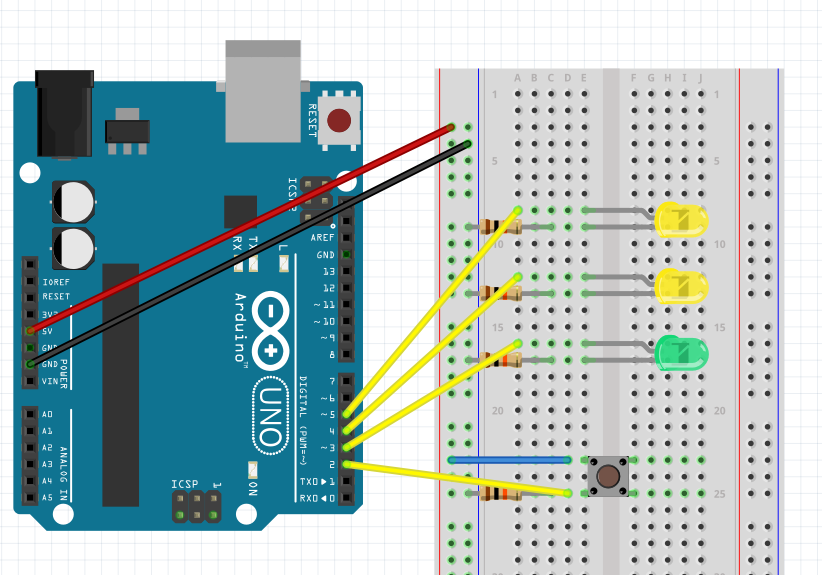

# 🔌 Arduino Starter Kit - Project 2 : Spaceship Interface


---

## 🧭 Table of Contents
- [Overview](#-overview)
- [Components Used](#-components-used)
- [Circuit Diagram](#-circuit-diagram)
- [Demo](#-demo)
- [Code](#-code)
- [What I Learned](#-what-i-learned)

---

## 🧠 Overview
This project is part of the **Arduino Starter Kit** series.  
The goal of this experiment is to simulate a **spaceship control panel** using LEDs and a push button.  
When the button is pressed, the LEDs change their lighting pattern — similar to activating a spaceship mode.  

This project introduces:
- The basics of **digital input/output** on Arduino  
- Controlling multiple **LEDs via code**  
- Understanding how hardware and software interact  

---

## 🧰 Components Used

| Component | Quantity | Description |
|------------|-----------|-------------|
| Arduino Uno | 1 | Main microcontroller board |
| LED (Red, Yellow, Green) | 3 | Visual indicators for the interface |
| 220Ω resistor | 3 | Current-limiting resistors for LEDs |
| 10kΩ resistor | 1 | Pull-down resistor for the button |
| Push button | 1 | User input control |
| Jumper wires | 7 | Circuit connections |
| Breadboard | 1 | Prototyping base |

---

## 🧩 Circuit Diagram



---

## 🎬 Demo


*(If the GIF doesn’t load, check the `/images/test.gif` file in the repository.)*

---

## 💻 Code

You can find the source file in [`/code/spaceship_interface.ino`](./code/code.ino).  
Here’s the main program used in this project:

```cpp
void setup() {
  pinMode(3, OUTPUT);
  pinMode(4, OUTPUT);
  pinMode(5, OUTPUT);
  pinMode(2, INPUT);
}

void loop() {
  int SwitchState = digitalRead(2);
  if (SwitchState == LOW) {
    digitalWrite(3, HIGH);
    digitalWrite(4, LOW);
    digitalWrite(5, LOW);
  }
  else {
    digitalWrite(3, LOW);
    digitalWrite(4, LOW);
    digitalWrite(5, HIGH);
    delay(500);
    digitalWrite(4, HIGH);
    digitalWrite(5, LOW);
    delay(500);
  }
}
```

## 🧩 Code Explanation

- Pin 2 → Push button input
- Pins 3, 4, 5 → Control the LEDs
- When the button is not pressed, only the Green LED turns on
- When the button is pressed, the yellow LEDs blink alternately, simulating a “spaceship activation” sequence

--- 

## 📚 What I Learned

- Basics of C/C++ programming (variables, instructions, functions)
- Controlling LEDs through digital pins using the Arduino IDE
- Understanding input/output logic between hardware and software
- Discovering how small wiring mistakes can change circuit behavior
- This project helped me strengthen my understanding of how to control and synchronize code and electronic components.


<p align="center">
  <a href="https://github.com/Siaibou">⬅️ Back to my GitHub Portfolio</a> •
  <a href="https://github.com/Siaibou/Electronics_ArduinoProject">🔌 View all Arduino Projects</a>
</p>


