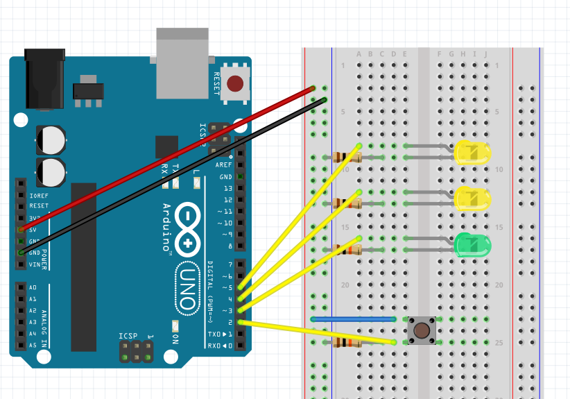

# 🔌 Arduino Starter Kit - Project 2 : Spaceship interface

## 🧭 Table of Contents
- [Overview](#-overview)
- [Components Used](#-components-used)
- [What i learned](#-what-i-learned)

## 🧠 Overview
This project is part of the Arduino Starter Kit series.  
The goal is to 
---

## 🧰 Components Used
| Component | Quantity | Description |
|------------|-----------|-------------|
| Arduino Uno | 1 | Main source of power |
| LED | 3 | Yellow and Green LEDs|
| 10kΩ resistor | 4 | Current limiting resistors for LEDs |
| Push button | 1 | Input control |
| Jumper wires | 7 | For circuit connections |
| Breadboard | 1 | Prototype base |

---

Schema of the project :

## 📚 what i learned 

- Learned the basic of C/C++ programmation (variable, instructions, functions)
- Learned how to manage LEDs light using the arduino IDE
- First use of digital pins
- Discovered how small wiring mistakes can affect the behavior of LEDs.

This project helped me strengthen my understanding of basic circuit theory and component connections before moving to more complex Arduino projects.

---

  <a href="https://github.com/Siaibou">⬅️ Back to my GitHub Portfolio</a> •
  <a href="https://github.com/Siaibou/Electronics_ArduinoProject">🔌 View all Arduino Projects</a>

